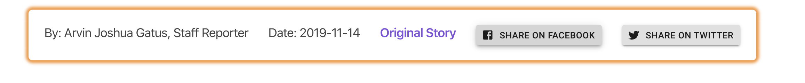

##### Open La Voz (De Anza) news site
this project helps students access and share La Voz Stories while 
protecting the privacy of readers through proxy loading and a privacy 
savvy client with no trackers or cookies.

###### Project Goals
- Allow Student Developers To Customize the look and feel of content.
- Ease and Open Access to Public information.
- Give Privacy Focused and Power Users a platform to read.
- Demonstrate the use of the lavoz-scraper GraphQL API for apps.
- Provide Rich Accessibility tools to Disabled users.

###### Accessibility Features
Features include rich descriptions,
content and interactivty for screen readers like Chrome Vox. 

